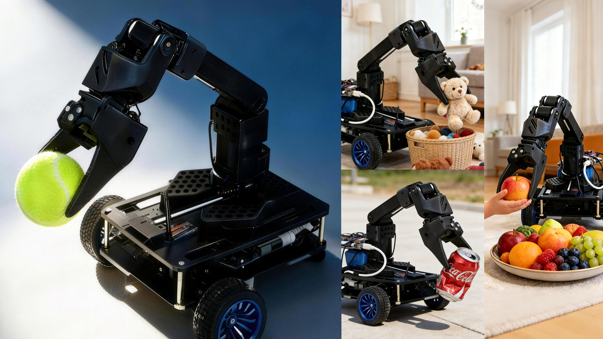
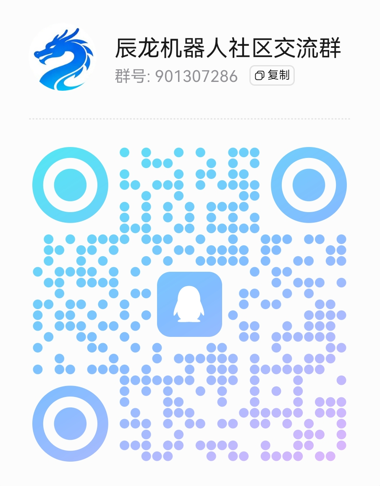

# AKA-00

🤖 全开源辰龙AI教育机器人，降低具身智能学习门槛！

💰 299¥，一只耳机价，让人手一台AI机器人成为可能！



视频：[B站辰龙机器人捡球视频](https://www.bilibili.com/video/BVxxx)

## 📰 新闻

- **2026.4.2**：[299元的辰龙AI教育机器人杀进社区，具身智能的"平民化拐点"已至](https://mp.weixin.qq.com/s/j8OQqoJPdnPGpCfcy5K-Qg)
- **2026.4.1**：[【北京市政府官网报道】299元"手搓"机器人！海淀这家企业，带中小学生玩AI](https://www.beijing.gov.cn/fuwu/lqfw/gggs/202604/t20260401_4572025.html)
- **2026.3.31**：[2026"AI原点杯"全国高校机器人网球抓取大赛报名启动](https://mp.weixin.qq.com/s/bmG5Za7K19GzOHPdTd6O1A)
- **2026.3.23**：[299元，AI原点社区"手搓"机器人将走进千家万户](https://mp.weixin.qq.com/s/oqU5rqGByOrXw3BGT0NAXg)
- **2026.3.17**：["手搓"一个机器人，需要几步？这是辰龙AI机器人在北京AI原点社区的答案](https://mp.weixin.qq.com/s/NPAx-GOC3DAy6-46ltMbig)
- **2026.3.11**：["手搓经济"火了！在京张遗址公园AI创新带，创新可以这么接地气](https://mp.weixin.qq.com/s/1OS5v4nLBUfu4w5yW0DWmQ)
- **2026.3.10**：[【北京时间】"手搓"机械臂 小成本撬动大创新](https://m.btime.com/item/45f615ca83dc8bc19b6578d93be)
- **2026.2.28**：[2026"新春第一会"成功召开！北京AI原点社区重磅签约海淀区"1+X+1"现代化产业体系建设布局！](https://mp.weixin.qq.com/s/43tqfgR5vWyXNMvIIJGpRw)
- **2026.2.6**：[【央视新闻】"十五五"开好局起好步 "创新生态"内如何"长出"产业链？](https://content-static.cctvnews.cctv.com/snow-book/video.html?item_id=3222772778021294082&t=1770334881318&toc_style_id=video_default&share_to=wechat&track_id=69617c7b-a6ff-4ff8-a7ec-bcfffbed544c)

## 🙌 关于我们

从2024年的初步构想，到2025年依托开源机械臂项目实现技术突破，再到2025年底提出概念：让人手一台机器人成为可能！这一路，有不少优秀的伙伴参与进来，和我们一起把机器人硬件做的更加低成本，共同把这个开源项目做得更好！

终于在2026年初，299元辰龙AI教育机器人正式落地！它能完成"识别网球位置—自主移动—完成捡球动作"的视觉-运动-执行完整闭环。软硬件开源，使得学习者可以进行二次开发改造，降低具身智能的学习门槛。辰龙机器人是一个面向教学的低成本AI机器人，通过提供简单的平台实现多种算法的训练和仿真。

## 💬 交流社区

 


QQ群：901307286

## 📖 文档

[辰龙AI教育机器人技术文档](./docs/src/README.md)

## 💰 总成本

299¥ 即可购买辰龙AI教育机器人组件套装，微信小店购买：[链接]

## 🚀 快速开始

1. 💰 购买硬件：[购买链接]
2. 🔨 组装：[组装文档/视频链接]
3. 💻 软件课程，请报名训练营学习：[训练营课程链接]

## 目前功能

### ✅ 已完成

| 功能 | 说明 |
|------|------|
| 机械臂控制 | 控制机械臂完成抓取和释放动作 |
| 底盘运动 | N20 电机差速控制，支持前进/后退/转向 |
| Web API | 提供 HTTP 接口远程控制机器人 |
| Web 界面 | React 前端，可远程控制机器人运动和夹爪 |

## 代码结构

```
AKA-00/
├── run.py              # Web 服务器入口
├── tennis_hunter.py    # 机器人主程序
├── app/                # Flask Web 应用
├── src/                # 硬件控制模块（机械臂、电机、摄像头）
├── frontend/           # React 前端
└── models/            # YOLOv8 模型文件

详细说明见 [文档](./docs/src/06-development/structure.md)
```

## 技术栈

### 后端

| 技术 | 用途 |
|------|------|
| Python 3.11 | 核心语言 |
| Flask | Web 框架 |
| pyserial | 串口通信（舵机） |
| python-periphery | PWM 控制 |

### 前端

| 技术 | 用途 |
|------|------|
| React 19 | UI 框架 |
| TypeScript | 类型安全 |
| Vite | 构建工具 |

### 硬件

| 设备    | 型号                |
|-------|-------------------|
| 开发板   | [LicheeRV Nano](https://wiki.sipeed.com/hardware/zh/lichee/RV_Nano/1_intro.html) |
| 机械臂舵机 | ZL-ZP10S |
| 电机    | N20 直流减速电机        |

## 环境变量

| 变量名 | 默认值 | 说明 |
|--------|--------|------|
| `APP_HTTP_PORT` | 80 (Linux) / 5000 (Windows) | HTTP 服务端口 |
| `APP_HTTPS_PORT` | 443 (Linux) / 5443 (Windows) | HTTPS 服务端口 |
| `APP_CERT_PATH` | /root/AKA-00/cert.pem | HTTPS 证书路径 |
| `APP_KEY_PATH` | /root/AKA-00/key.pem | HTTPS 密钥路径 |

## API 接口

### 获取 IP 地址

```bash
GET /api/ip
```

响应：
```json
{
  "ip": "192.168.1.100"
}
```

### 控制接口

```bash
GET /api/control?action=<action>&speed=<speed>&time=<time>
```

参数说明：

| 参数 | 类型 | 说明 |
|------|------|------|
| action | string | 动作：`up`, `down`, `left`, `right`, `stop`, `grab`, `release` |
| speed | int | 速度 0-50 |
| time | int | 持续时间（毫秒） |

示例：

```bash
# 前进
curl "http://192.168.1.100/api/control?action=up&speed=30&time=1000"

# 抓取
curl "http://192.168.1.100/api/control?action=grab"

# 释放
curl "http://192.168.1.100/api/control?action=release"
```

## 硬件配件详情

### 机械臂

- **型号**: ZL-ZP10S 或 STS3215
- **通信**: 串口 UART (`/dev/ttyACM0`, 115200 波特率)

### 电机

- **型号**: N20 直流减速电机
- **控制**: PWM 调速
- **左电机**: chip=4, ch1=0, ch2=1
- **右电机**: chip=4, ch2=2, ch3=3

## 🙏 致谢

[](https://github.com/chenlongos/AKA-00/graphs/contributors)
[](https://github.com/chenlongos/AKA-00/commits/main)

感谢所有为 AKA-00 做出贡献的人！

<!-- ALL-CONTRIBUTORS-LIST:START - Do not remove or modify this section -->
<!-- prettier-ignore-start -->
<!-- markdownlint-disable -->
<div align="center" style="display: flex; justify-content: center; gap: 20px; flex-wrap: wrap;">
  <a href="https://github.com/BoBoDai"><br /><sub><b>BoBoDai</b></sub></a>
  <a href="https://github.com/shzhxh"><br /><sub><b>shzhxh</b></sub></a>
  <a href="https://github.com/moyufei-MAX"><br /><sub><b>moyufei-MAX</b></sub></a>
  <a href="https://github.com/yydawx"><br /><sub><b>yydawx</b></sub></a>
</div>
<!-- markdownlint-restore -->
<!-- prettier-ignore-end -->

<!-- ALL-CONTRIBUTORS-LIST:END -->
<!-- prettier-ignore-end -->

## 💪 贡献

👋 想要为 AKA-00 做出贡献吗？请参阅 [CONTRIBUTING.md](./CONTRIBUTING.md)，了解如何参与。

## 免责声明
