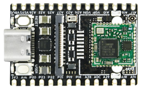
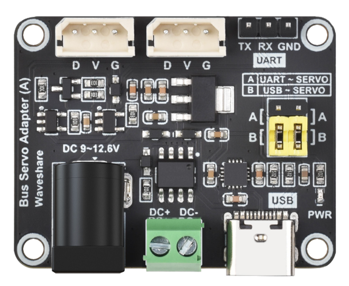
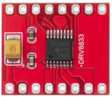

# 硬件参数

## 主控板

| 参数 | 值                                                                                |
|------|----------------------------------------------------------------------------------|
| 型号 | [LicheeRV Nano](https://wiki.sipeed.com/hardware/zh/lichee/RV_Nano/1_intro.html) |
| CPU | 算能 SG2002   大核：1GHz RISC-V C906 / ARM A53 二选一; 小核：700MHz RISC-V C906；       |
| NPU | 1 TOPS (INT8)，支持 BF16                                                               |

## 机械臂控制板(微雪UART串口通信控制板)

| 参数 | 值 |
|------|-----|
| 型号 | ZL-ZP10S |
| 通信 | 串口 UART |
| 设备 | /dev/ttyACM0 |
| 波特率 | 115200 |

### 舵机支持

- **STS3215** 
- **MG996R**
- **ZL-ZP10S**

## 电机控制板(DRV8833)

| 参数 | 值 |
|------|-----|
| 型号 | N20 直流减速电机 |
| 控制方式 | PWM 调速 |
| GPIO Chip | 4 |