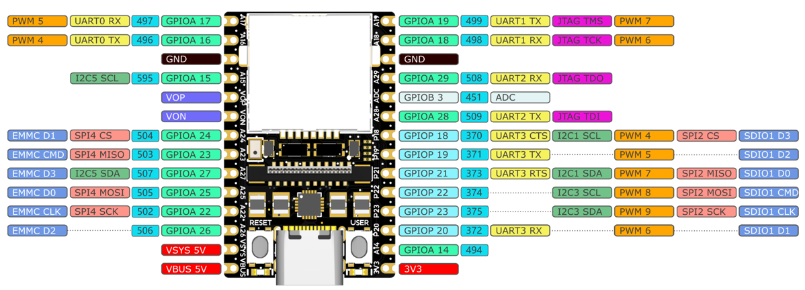
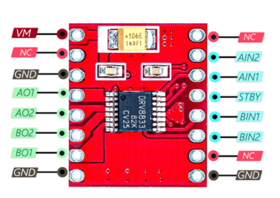
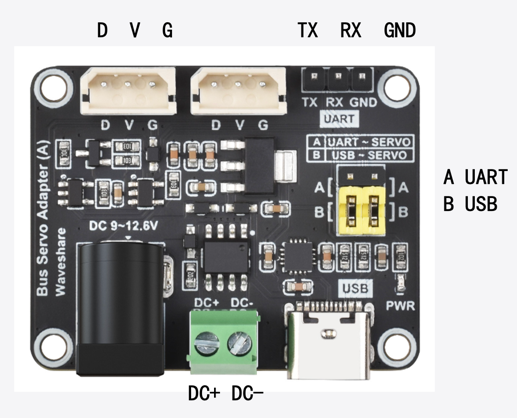
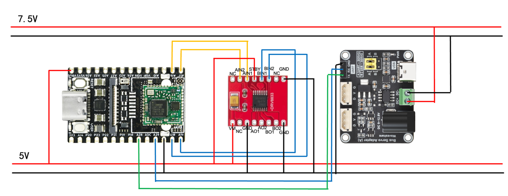

# 硬件接线

## 接线示意

### 主控接口图

- 使用了
  - 电机控制
    - A16：PWM4
    - A17：PWM5
    - A18：PWM6
    - A19：PWM7
  - 舵机控制
    - A28：UART2TX
    - A29：UART2RX
  - VBUS 5V
  - GND

### 底盘控制板接口图

- VM：电机供电
- NC：置空
- GND：接地
- A、BO1、2：接电机
- A、BIN1、2：控制信号输入
- STBY：SLEEP控制，底电平有效

### 机械臂控制板接口图

- D：数据总线
- V：舵机供电正级
- G：舵机接地
- DC+：主控供电正级
- DC-：主控供电负极
- TX：控制输入
- RX：控制接收
- GND：接地
- A UART：UART总线控制模式
- B USB：USB总线控制模式

### 控制电路连线图

接线前请确保断电操作。

### 机械臂

- 机械臂串口连接至 `/dev/ttyACM0`
- 波特率：115200

### 电机

| 电机 | GPIO Chip | Channel |
|------|-----------|---------|
| 左电机 | 4 | 0, 1 |
| 右电机 | 4 | 2, 3 |

### 摄像头

- USB 接口，设备文件：`/dev/video0`

## 原理图

硬件原理图位于 `hardware/` 目录：

- `LicheeRV_Nano-70418_Schematic.pdf` - 主控板原理图
- `sg2000_trm_cn.pdf` - SG2000 技术参考手册
- `众灵舵机使用手册-250508.pdf` - 舵机使用说明
