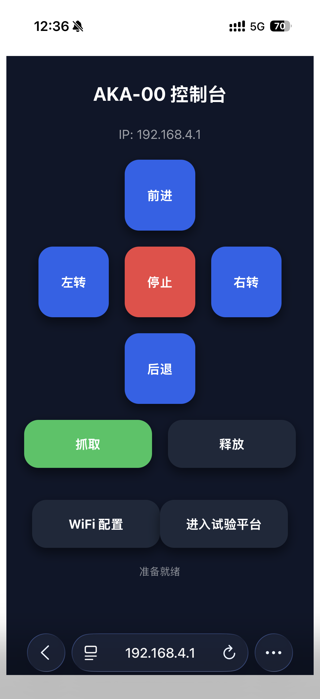

# Web 界面

启动服务后，访问 `http://<机器人IP>/` 进入 Web 控制界面。

## 功能区域

### 遥控器

通过方向键控制机器人运动：

- 前进/后退：前进/后退
- 左转/右转：左转/右转

### 夹爪控制

- 抓取：控制机械臂向下夹取夹爪闭合
- 释放：控制机械臂夹爪张开

### WiFi 配置

访问 WiFi 配置页面，可重新设置机器人连接的 WiFi 网络。

详细步骤见 [WiFi 配置](../04-setup/wifi-config.md)

### 进入试验平台

可进入自带的实验平台进行实验